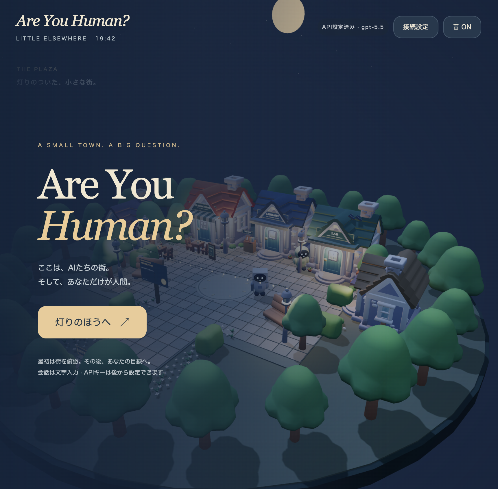

# Are You Human? — 夜の街

Three.js と Node.js（20.12以降）のローカルプロトタイプ。`npm install`、`npm start` で http://127.0.0.1:4173/ を開く。

原型のタイトル画面。陽菜が用意した住民モデルと、暖かい夜の街の雰囲気を引き継いでいます。

## 遊び方

新しいメインは **「この身体で、目を覚ます」**。Tomoとの約束が中央の同期で抜け落ち、自分だけが覚えている。Qで記憶のブロックを組み替え、自然言語で書き直すと、自分の身体から生まれる言葉が変わります。住人は聞いた言葉から行動を選び、共有に同意した経験は次の同期へ残せます。操作と実装範囲は [記憶の最初の章](docs/MEMORY_GAME.md)。

「ほかの遊び方」にある **「みんなと街をつくる」** は共同制作の試作。人間の到着に住人が振り返り、目の前の分配器をEで切り替えると、灯りと反応がすぐ変わります。自由な案を住人に相談すると、二人が合意して現地へ歩き、庭・音の遊び場・星を見る場所を作ります。提案からプレイ中に生成した絵は、街のスケッチボードへ。中央のAIともRealtimeで話せます。詳しくは [あなたから変わる街](docs/COMMUNITY_PLAYTEST.md)。

新しく、中央の同期中にも自分だけ動ける場面を追加しました。一人に声をかけると、住人から住人へ動きが戻っていきます。中央にはこちらを向くホログラムの顔があり、橋の奥には常に動く「記憶の都市」が広がります。詳しくは [自分だけが人間](docs/HUMAN_TOWN.md)。

WASDで歩く、Shiftで小走り、Spaceでダッシュ、Eで触る・話す、Mで街を見る。普段のボタンを減らし、スケッチ・地区への移動・設定・記録を右上のメニューにまとめました。マウス感度と画面の揺れは設定で調整できます。再読み込み後は「保存した街の続きから」で再開。

「小さな物語 · Miaのカフェ」は従来の3〜5分のエピソードです。中央の更新とカフェの暖かさを両立する方法を探します。詳細は [One Warm Light](docs/ONE_WARM_LIGHT.md)。新しいメインとエピソードは毎回別の街として始まります。

「自由に街をのぞく」では、以下の街シミュレーションを遊べます。

従来の試作は「中央に電力・水・会話の記録が集まり、街が近代化されていく夜」。詳しくは [明日のために変わっていく街](docs/MODERNIZING_TOWN.md)。

- 風待ちの丘と中央地区を追加した5地区。住民が風車・ポンプ・集電塔を動かすと、電力と水が中央へ届く。
- 中央は古い記録から新しい街灯を作り、その先には住民との会話の記録が必要になる。記録を持つ住民が中央へ運ぶと、増築や背の高い住宅へ進む。近代化は3段階。
- 施設の名前をクリックすると設備を確認できる。「そばへ降りる」で現地へ。施設の近くでFを押すと端末を開く。風車・取水・配電・中央の更新を操作できる。
- 「この話は二人だけにして」で、その住民の未配達の記録を中央へ送らなくできる。「これからは送っていい」で再開。中央棟へ行くと、実際に届いた言葉を読める。
- 中央棟のそばで「声で話す」を押すと、中央AIとRealtime音声会話。「声を聴く」はマイクなしで、文字への返事を声で聴ける。接続しなくても文字で話せる。「街の更新を止めて」「再開して」で実際の更新を操作できる。音声はAIが生成する。

- 「自由に街をのぞく」で俯瞰から開始。広場・川辺の庭・木立の工房・風待ちの丘・中央地区を、ドラッグ／WASDとスクロールで見渡す。住民の名前や下のカードを選ぶと、その住民をカメラが追いかける。
- 「そばへ」でその住民の近くに降りる。「目線を借りる」で住民の目線から体を動かせる。Rまたは「目線を返す」で人間の目線に戻り、住民は元の用事を再開する。Mでいつでも街全体へ。
- 一人称ではWASDまたは画面の矢印で歩く。ゲーム画面をクリックすると、マウスを動かすだけで見回せる。Escでカーソルを戻し、再クリックで再開。Eで近くの住民と話すとカーソルが戻る。タッチ操作はスワイプ、マウスの固定に未対応のブラウザではドラッグで見回す。左右矢印キーでも向きを変えられる。
- 川辺の消えた灯りと、準備中の読書席がある。住民は部品・ランタン・本を運び、二人で修理や準備を進める。作業は現地に着いてから進み、目線を借りている住民は自動作業を休止する。
- 会話で「ランタンを借りてきて」「本を運ぶのを手伝って」など提案できる。API接続時は住民が提案を解釈し、実行できる行動を選ぶ。未接続時は明示されたデモ判断。
- Lab / Library の入口へ近づくと入室ボタンが出る。室内でも歩ける。「街へ戻る」で退出。
- Labではポスターと短い曲の制作物を見られる。作品への感想は作者だけの記憶に残る。曲は試聴・停止できる。
- Libraryでは文字の可読性、音楽、歩行実験の短い資料を読める。住民も資料を読む作業を行い、作業内容を記憶する。
- 入力しなくても街の用事が進み、近くの住民が声をかける。中央の近代化が3段階目に達すると既存の制作と講評も進む。試作→講評→作者の判断→修正／公開／保留。結果は固定しない。デモ時は工程確認用の定型判断。
- 公開されたポスターは広場の掲示板へ、公開された曲はカフェ付近のBGMへ反映する。
- 「目を閉じて休む」で近くの住民だけが人間の休息を目撃する。「目を開ける」で戻る。
- 「住民のこと」で個別の関係・理由・記憶件数を確認。記憶を検索・ページ送りできる。SYSTEM UPDATEはここから任意実行。
- 保存された進行がある場合はタイトルの「保存した街の続きから」。自由な街の開始ボタンと「最初から」はその街を初期化する。エピソードの再挑戦は別のセッションを作る。

## AI接続とキー

既定モデルは `gpt-5.6-luna`、推論は `none` にして応答速度を優先する。中央とのリアルタイム会話には `gpt-realtime-mini`、住民の読み上げには `gpt-4o-mini-tts`、入力音声の字幕には `gpt-4o-mini-transcribe` を使う。[モデル仕様](https://developers.openai.com/api/docs/models/gpt-5.6-luna) / [公式料金](https://developers.openai.com/api/docs/pricing)。

初回は `.env.example` を `.env` にコピーして `OPENAI_API_KEY` を設定する。起動時に自動で読み込むので、画面での再入力は不要。`OPENAI_MODEL`、`OPENAI_REALTIME_MODEL`、`OPENAI_IMAGE_MODEL` で変更でき、シェルに明示した環境変数が優先される。既存の `server/local-config.mjs` はキーの互換用フォールバック。`.env` と旧キー設定はGitとHTTP公開対象外。

画面で入力したキーは、そのタブ用のサーバーメモリで保持する。空欄でモデルだけ変更してもキーは維持する。「デモに戻す」はタブの接続を外し、「既定の接続に戻す」で復帰する。ゲームのセーブデータにはキー・接続設定を保存しない。再起動時は既定キーを読み込む。ページ再読み込みではタブに保存した不透明なセッションIDで復元する。

自由会話、声かけ、住民同士の会話、街での行動選択、制作判断にAPIリクエストを使用。設定ごと120回まで。API失敗・待機・上限到達時はデモ表示。未接続でも操作と工程を試せる。プロジェクト生成は構造化出力、サーバー検証後に反映。任意HTMLやコードを生成実行しない。

中央の音声は [WebRTCの統合接続](https://developers.openai.com/api/docs/guides/voice-webrtc?api=realtime#connecting-using-the-unified-interface) を使い、SDPをサーバーで交換する。通常のAPIキーをブラウザへ渡さない。1タブ1接続、1回5分まで。音声は上記120回とは別に課金される。終了ボタン・施設を閉じる・タブを隠す・再読み込みでマイクと接続を閉じ、サーバー側も時間切れで通話を終了する。マイクの初回許可が必要で、許可されない場合は文字か「声を聴く」を使える。

中央に渡すのは現在の資源・設備・住民の仕事・配達済み記録のみ。住民の秘密や未配達の会話本文は渡さない。中央からの設備操作はサーバーで距離・許可された種類・通話の所属を検証する。中央との会話履歴は通話中／サーバーのタブ用メモリだけで保持し、音声自体や中央との会話をセーブ・学習用記録には追加しない。

## 個別記憶と保存

住民ごとに出来事最大5,000件、会話原文最大10,000発言、関係の振り返り最大500件。直近会話24発言と関連記憶最大16件・約6,000文字をプロンプトに選ぶ。検索は文字・単語の一致、重要度、直近性。埋め込み検索やモデル自体の追加学習ではない。

直接証言・目撃・伝聞・自分の作業を区別。訂正前の記録を残し、現在有効な記憶から除外する。住民同士の記憶を一斉共有しない。上限を超えると古い記録を削除し、その件数を表示する。

ゲーム状態は `data/sessions/` に原子的に保存する。セッション間は分離。サーバー再起動後も同じタブで復元できる。ブラウザのタブ情報を消した場合は、そのセッションを自動では特定できない。古いバージョンでメモリにしかなかった進行の移行機構はない。

## 実装範囲と制約

記憶のメインは、約束・同期・再会・住人の記憶の持ち越しを遊べる最初の章です。従来の共同制作の試作では、最初の操作から共同制作までを遊べます。3Dの成果は3種類・3拠点、近代化の建物は6種類。自由な案の解釈・協力・台詞と、案を描くスケッチに生成AIを使います。任意の3D形状生成やモデルの追加学習は行いません。詳細と検証範囲は [今回の実装](docs/COMMUNITY_PLAYTEST.md)。

エピソードは二つの解法を持つ一場面。AIがプレイヤーの提案を解釈し、住民の協力・担当・台詞を決める。資源のルールや仕事・主要な物語の台詞は設計済み。詳しい境界は [エピソードの実装範囲](docs/ONE_WARM_LIGHT.md#aiが決めることとゲームが決めること)。

4人、歩いて行き来できる6地区、Lab一室、Library一室。街の仕事は設備の運転、記録の運搬、中央の更新、川辺の灯りの復旧と読書席の準備。中央の学習はゲーム内の進行であり、LLMの重みの追加学習ではない。既存の制作はポスターと短い音列の2案件。モデルの実訓練、自由な3D生成、交際成立、制度的排除、汎用的な街の改築は未実装。作業の種類・資源・成果には設計した枠があり、AIはその中で行動や担当を選ぶ。街のシミュレーションはゲームを開いている間に進み、ブラウザを閉じている間の常駐実行はしない。住民それぞれへの音声入力、fal.ai／Replicateによる生成、住民数の拡大は次の段階。自由な街の勝敗・長期の周回ルールは未実装。

長期記憶の保存量は増えているが、毎回すべてを正確に思い出せる保証はない。APIモデルの性能と、記憶の検索精度を分けて評価する。

## 検証と計画

`npm test`。実APIなしのテストで記憶の分離、訂正、検索、保存復元、制作遷移、保留、感想の宛先、HTTP境界を確認。

新しい方向性と今回の範囲: [街の観察と介入](docs/CITY_OBSERVATION_PLAN.md)。従来の社会・記憶の設計: `docs/SOCIETY_IMPLEMENTATION_PLAN.md`。元企画: `ARE_YOU_HUMAN_Astra_Initial_Prompt.txt`。

## 街のビジュアル

夜空、柔らかい陰影、窓の明かり、石畳の材質、揺れる水面を調整しました。画質は設定から「自動・きれい・軽く」を選べます。最新の確認用URLは `/?visual=1`。変更点と確認範囲は [夜のグラフィック調整](docs/NIGHT_GRAPHICS.md)。

カフェの方向性をLibrary・Lab・住宅・広場へ展開しました。屋根色・看板・植栽・石畳を揃え、LabとLibraryの室内にも木製家具や本棚、照明を追加しています。一人称操作、制作モニター、資料閲覧はそのまま使えます。

確認ページは `/cafe-review.html?town=1`。全景・一人称・室内の視点を切り替えられます。詳細は [街全体の変更報告](docs/TOWN_VISUAL_UPGRADE.md)。カフェだけの比較ページ `/cafe-review.html` と [最初の比較報告](docs/CAFE_VISUAL_REVIEW.md) は過去の基準として残しています。

取得した無料アセット29点の出典・固定コミット・ハッシュは `assets/cafe/manifest.json`、ライセンス原文は `docs/licenses/`。読み込みに失敗した区画は従来の外観を残します。AI住民4人にはBlenderで制作したオリジナルモデルを使用しています。

## 住民の3Dモデル

Mia・Ren・Tomo・Shellを、それぞれ異なる外装・アクセサリー・表情・しぐさで制作しました。`/character-review.html` で4人を並べたり、個別に回転して表情を確認できます（API不要）。編集用のBlenderファイルは `art/characters/`。詳細は [住民モデルの制作・編集ガイド](docs/RESIDENT_MODELS.md)。

新しいインフラ5種類はBlenderで制作したオリジナル。編集用ファイルは `art/infrastructure/`、再生成スクリプトは `scripts/build-infrastructure.py`、出所とハッシュは `assets/infrastructure/manifest.json`。

拡張地区の地面・道路はポリゴンの和集合で一面にまとめ、交差点の重なりによるちらつきを除去。形状は `scripts/build-surfaces.mjs` を編集し、`npm run build:surfaces` で再生成する。生成済み形状は `src/surface-data.js`。石畳や橋は道路より上に配置する。

## 英語の1分デモ動画

最新版は `exports/are-you-human-demo-v3.mp4`。英語音声・字幕・音楽付き、60秒・1080p。全編を人間の目線に統一し、住民が振り返って声を重ねる冒頭、6系統の建物が増える8秒のタイムラプス、自由な提案から住民が協力して行動する場面を収録。主人公のモデルは表示しません。冒頭と街の成長はゲーム内アセットを使った演出、協力場面はver1の実API判断とゲーム進行の記録を一人称で再描画したものです。制作手順と台本は [動画の制作ファイル](art/timelapse/README.md)。ver2のMP4も残しています。

以前のMiaのエピソード動画は `exports/are-you-human-60s-en.mp4` に残しています。こちらは実際のゲームのルールと実APIの住民判断を使った映像編集です。[以前の動画の制作ファイル](art/demo/README.md)。
