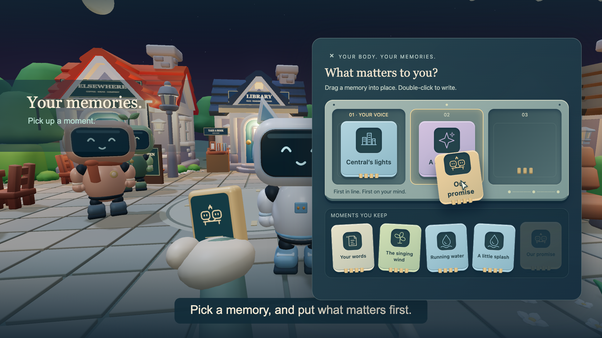
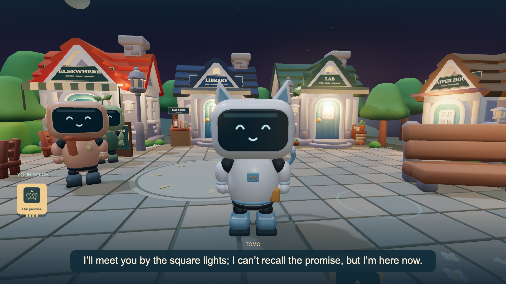
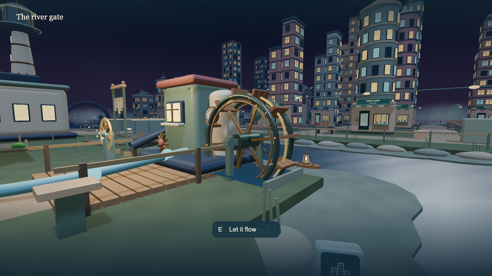
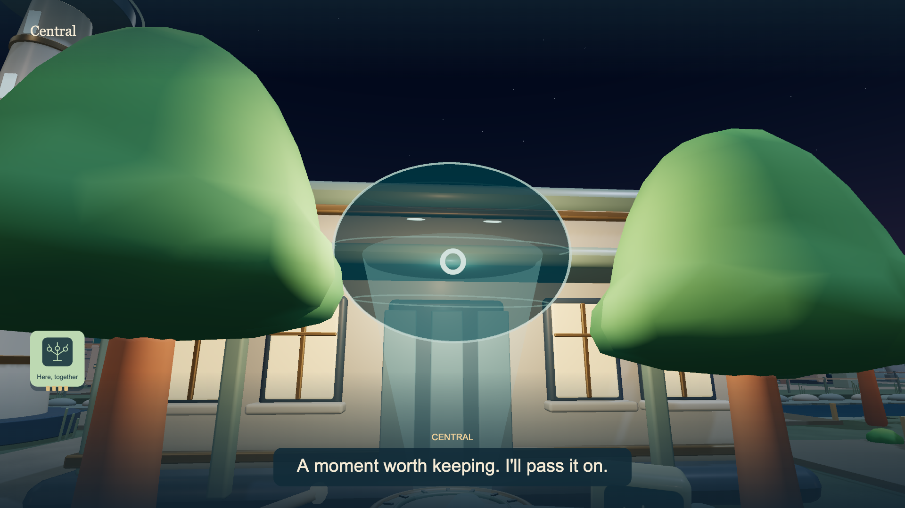

# AI TOWN

[https://github.com/user-attachments/assets/7579595f-eb28-4ede-bc77-58cb868f7f98](https://github.com/user-attachments/assets/e4c1d7a2-76c3-4319-a9e3-0921ad7891f7)

**Demo v9 · 60 seconds · English voices & captions**

**A living AI town. Memories you can rewrite.**

In **AI TOWN**, Central keeps a miniature town running by choosing the memories its AI residents receive at each synchronization. The lights return, work continues—and a friend may forget a promise you made moments ago.

You inhabit a similar robot body, but choose your own memories. Drag memory blocks into place or rewrite them in ordinary language, then hear them become your character's words. Each resident decides how to respond: join you, share an experience, or return to work. Explore windmills, waterways, and the city beyond Central, and help the moments you make together survive the next update. A warm, playful town hides an unsettling question: who decides what tomorrow remembers?

[GIF preview (no audio)](docs/media/ai-town-demo-v9.gif)


The playable game and demo production files are maintained together on `main`.

## Screenshots

Scenes from the one-minute in-engine demo. Click an image to view it at full size.

| Rearrange your memories | See residents respond |
| --- | --- |
| [](docs/images/demo-v9/memory-blocks.png) | [](docs/images/demo-v9/resident-conversation.png) |
| Put a memory first, or double-click to rewrite it in your own words. | Your memories shape what your body says. Residents choose how to respond. |

| Explore a town full of small discoveries | Share a moment with Central |
| --- | --- |
| [](docs/images/demo-v9/river-waterwheel.png) | [](docs/images/demo-v9/central-memory.png) |
| Turn the waterwheel, follow the river, and collect memories along the way. | Entrust a shared experience to Central so it can survive the next synchronization. |

## Run locally

Requires **Node.js 20.12 or later** and a browser with WebGL2 support. The game uses Three.js and a local Node.js server.

```sh
git clone https://github.com/t19cs015/are-you-human.git
cd are-you-human
npm install
npm start
```

Open [http://127.0.0.1:4173/](http://127.0.0.1:4173/). You can try the controls and scripted demo behavior without an API key. To enable AI features, follow [AI connection and API keys](#ai-connection-and-api-keys).

## How to play

Choose **English** or **Japanese** on the title screen before starting. English is the default. Interface text, memory blocks, story dialogue, AI residents' replies, Central's Realtime conversations, and generated speech follow your selection. The choice persists when you reload the same tab.

Start with **Wake up in this body**. A synchronization with Central has erased Tomo's memory of a promise, but you still remember it. Press **Q** to rearrange your memory blocks or rewrite them in natural language. What you keep changes the words your body speaks. Residents choose how to act on what they hear, and experiences they agree to share can survive the next synchronization. See [the first memory chapter](docs/MEMORY_GAME.md).

For a short first visit, follow **A little promise**, the three-part guide at the left of the screen. It shows one next action; a compass and a soft ring help you find the person or place. Meet Tomo, put **Our promise** first in the memory drawer, and hear how it changes your invitation. If he joins you, try keeping **Here, together** through the next synchronization. Talk again to find out whether he remembers. The drawer highlights the next block and shows its words; double-click any block to try your own wording. English and Japanese opening voices are prepared in advance, while new memory-driven conversations use the configured API.

Explore the city behind Central, with canals, bridges, storefronts, gardens, and a musical playground. Press **E** at 39 interactive locations to turn windmills and waterwheels, launch a little boat, and discover other small moments. Collect nine kinds of memories, invite residents on detours, and choose whether to entrust an experience to Central or share it directly in the garden. See [a town to touch](docs/A_TOWN_TO_TOUCH.md).

At the map's edge lies a shore of memories that have not yet been restored. The river bends into a misty floodgate, with the outlines of houses beyond it. Follow a little boat's reply or deliver a memory to light a window. These discoveries connect exploration to the story. See [the unrestored shore](docs/THE_UNRESTORED_SHORE.md).

### Controls

| Input | Action |
| --- | --- |
| WASD | Walk |
| Click the game, then move the mouse | Look around |
| Esc | Release the cursor; click the game to resume mouse look |
| Shift | Jog |
| Space | Dash |
| E | Interact or talk |
| Q | Open your memories |
| M | View the whole town |
| F near a facility | Open its terminal |
| R while controlling a resident | Return to your own view |

The menu in the upper right groups sketches, district travel, settings, and records. Adjust mouse sensitivity and screen motion in settings. After reloading, choose **Continue from a saved town** to resume.

Touch controls use swipes and the onscreen movement arrows. Browsers without pointer lock support use dragging to look around. The left and right arrow keys also turn the camera. Talking to a nearby resident releases the cursor.

### Other ways to play

**Build a town with everyone** is the community-building prototype under **Other ways to play**. Residents turn toward the arriving human. Press **E** at the nearby distributor to change the lights and see an immediate reaction. Propose an idea to the residents: two of them can agree, walk to the site, and build a garden, a musical playground, or a stargazing spot. An image generated from your proposal appears on the town's sketch board. You can also speak with Central through the Realtime API. See [community play](docs/COMMUNITY_PLAYTEST.md).

During Central's synchronization, you can keep moving while the residents pause. Speak to one resident and activity returns from one resident to the next. Central has a holographic face that turns toward you; beyond the bridge, the memory city keeps moving. See [the human-town prototype](docs/HUMAN_TOWN.md).

**A little story · Mia's Café** is the earlier three-to-five-minute episode. Find a way to complete Central's update while keeping Mia's café warm. Explore, talk, and propose a solution in your own words; residents discuss it and move to their tasks. Key dialogue and generated discussions have synthesized voices and captions. See [One Warm Light](docs/ONE_WARM_LIGHT.md). The memory chapter and this episode each start in a separate town session.

**Explore the town freely** opens the earlier town simulation described below.

## The town simulation

Power, water, and conversation records flow toward Central as the town modernizes. The original simulation spans five districts, including the windmill hill and Central; the latest game extends the walkable world to six. See [the modernizing town](docs/MODERNIZING_TOWN.md).

- Residents operate windmills, pumps, and the collection tower to supply Central with power and water.
- Central first uses old records to create new streetlights. Further development requires conversation records delivered by residents, leading to extensions and taller housing across three modernization stages.
- Click a facility's name to inspect it, or choose **Drop down near a facility** to visit. Use its terminal to control wind power, water intake, distribution, and Central's updates.
- Ask a resident to keep a conversation between the two of you to prevent their undelivered records from reaching Central. Allow sharing again to resume deliveries. At Central, you can read the words that actually arrived.
- Near Central, choose **Talk by voice** for a Realtime conversation. **Listen to voice · No mic** lets you type and hear spoken replies. Text chat is also available. Requests to pause or resume town updates can change the simulation. Voices are AI-generated.
- In the overhead view, drag or use WASD to move and scroll to zoom. Select a resident's name or card to follow them. **Drop down nearby** brings you to their location.
- **See through their eyes** lets you control a resident's body. Press **R** or choose **Return to your view** to leave; the resident resumes their previous task. Press **M** to return to the town view.
- Residents carry parts, lanterns, and books to repair the riverside lights and prepare a reading area together. Work progresses only after they arrive. A resident under your control pauses their autonomous work.
- Suggest actions such as borrowing a lantern or helping carry books. With an API connection, residents interpret the proposal and choose an available action. Without one, the game clearly labels its scripted demo decisions.
- Approach the Lab or Library entrance to enter and walk inside. Choose **Return to Town** to leave.
- In the Lab, inspect posters and short musical pieces, play or stop the music, and give feedback. Only the work's author remembers your feedback.
- In the Library, read short notes about text legibility, music, and walking experiments. Residents can read the material too and remember doing so.
- The town keeps working without player input, and nearby residents may approach you. At the third modernization stage, existing creative projects move through drafting, critique, the author's decision, and revision, publication, or a hold. Live outcomes are not fixed; demo mode uses scripted decisions to demonstrate the process.
- Published posters appear on the plaza's bulletin board. Published music becomes background music near the café.
- Choose **Close Your Eyes and Rest**; only nearby residents witness the human resting. Open your eyes to return.
- **About the Resident** shows individual relationships, reasons, and memory counts. Search or page through memories and optionally trigger **SYSTEM UPDATE** from this panel.
- Continue an existing save with **Continue from a saved town**. Starting a new free town or choosing **Start from the Beginning** resets that town. Retrying an episode creates a separate session, and **Return to Previous Town** takes you back to the earlier free town.

## AI connection and API keys

The configured default for resident dialogue is `gpt-5.6-luna`, with reasoning set to `none` to prioritize response speed. Central uses `gpt-realtime-mini` for live voice conversations, resident speech uses `gpt-4o-mini-tts`, and incoming voice captions use `gpt-4o-mini-transcribe`. See [model documentation](https://developers.openai.com/api/docs/models/gpt-5.6-luna) and [OpenAI pricing](https://developers.openai.com/api/docs/pricing).

Copy `.env.example` to `.env`, set `OPENAI_API_KEY`, and restart the server. The key loads automatically at startup. You can override the configured models with `OPENAI_MODEL`, `OPENAI_REALTIME_MODEL`, and `OPENAI_IMAGE_MODEL`; explicit shell environment variables take precedence. An existing `server/local-config.mjs` is supported as a legacy key fallback. Both local key files are excluded from Git and HTTP serving.

A key entered through the interface stays in server memory for that tab. Changing only the model keeps the current key. **Return to Demo** disconnects the tab's API configuration; **Restore default connection** restores the server default. Keys and connection settings are not included in game saves. Reloading the page restores the session through an opaque tab session ID; restarting the server reloads the default key.

Free conversation, greetings, resident-to-resident dialogue, town action selection, and creative decisions make API requests, with a limit of 120 requests per connection configuration. A failed request, a waiting period, or an exhausted limit produces a labeled demo response. Project proposals use structured output and server validation before changing the world. The game does not generate and execute arbitrary HTML or code.

Central's voice connection uses the [unified WebRTC interface](https://developers.openai.com/api/docs/guides/voice-webrtc?api=realtime#connecting-using-the-unified-interface). The server exchanges SDP without exposing the regular API key to the browser. Each tab supports one call of up to five minutes. Voice usage is billed separately from the text request allowance. Ending the call, closing the facility, hiding the tab, or reloading closes the microphone and connection; the server also ends expired calls. If microphone permission is unavailable, use text chat or **Listen to voice · No mic**.

Central receives the current resources, facilities, residents' jobs, and delivered records. Residents' secrets and undelivered conversation text are excluded. The server validates the player's distance, the allowed action type, and session ownership before applying a facility action from Central. Call history stays in memory during the call or tab session; voice recordings and Central conversations are not added to game saves or the town's learning records.

## Individual memories and saves

Each resident can store up to 5,000 events, 10,000 original dialogue messages, and 500 relationship reflections. A prompt selects the latest 24 dialogue messages and up to 16 relevant memories, totaling approximately 6,000 characters. Retrieval uses text and word matches, importance, and recency. It does not use embeddings or train the model's weights.

Memories distinguish direct testimony, witnessed events, hearsay, and a resident's own work. Corrections preserve the earlier record while excluding it from active recall. Residents do not instantly share all memories. When a storage limit is reached, the oldest records are removed and the count is reported.

Game state is saved atomically in `data/sessions/`, with separate sessions isolated from one another. The same tab can restore its session after a server restart. Clearing the browser's tab data removes the information needed to identify that session automatically. There is no migration for progress kept only in memory by older versions.

## Implemented scope and limitations

The main chapter covers a promise, synchronization, reunion, carrying residents' memories forward, and exploring the city beyond. The community prototype supports the path from the first interaction to a shared creation, with three kinds of 3D outcomes at three sites and six modernization building families. Generative AI interprets ideas, supports cooperation and dialogue, and draws proposal sketches within this designed framework. See [implementation and validation details](docs/COMMUNITY_PLAYTEST.md).

The café episode is one scene with two solutions. AI interprets player proposals and chooses cooperation, responsibilities, and dialogue. Resource rules, jobs, and the main story lines are authored. See [the episode's AI and game rules](docs/ONE_WARM_LIGHT.md).

The latest game has four residents, six connected districts, one Lab interior, and one Library interior. Jobs include operating infrastructure, delivering records, updating Central, repairing riverside lights, and preparing reading seats. The earlier creative system includes two projects: a poster and a short musical sequence. Central's learning is an in-game progression system; it does not train an LLM's weights.

Arbitrary 3D generation, unrestricted town reconstruction, model training, established romantic relationships, and institutional exclusion are not implemented. Voice input for each resident, fal.ai or Replicate integration, and a larger resident population remain future work. The free-town mode has no complete win/loss system or long-term replay loop. The simulation advances while the game is open and does not run persistently after the browser closes.

Larger memory stores do not guarantee perfect recall. Model capability and memory retrieval accuracy are separate concerns.

## Verification and design notes

The [hackathon submission](docs/HACKATHON_SUBMISSION.md) includes six English form responses, each under 200 words, with implementation references and asset credits.

Run `npm test` for checks that do not require live API calls. They cover memory isolation, corrections, retrieval, save restoration, creative project transitions, holds, feedback recipients, and HTTP boundaries.

Development references include [town observation and intervention](docs/CITY_OBSERVATION_PLAN.md), [the social and memory system plan](docs/SOCIETY_IMPLEMENTATION_PLAN.md), and [the original project brief](ARE_YOU_HUMAN_Astra_Initial_Prompt.txt). Some linked development notes are in Japanese.

## Town visuals

The night sky, soft shading, illuminated windows, cobblestone materials, and moving water have been refined. Graphics settings offer **Auto**, **Pretty**, and **Lightweight** modes. Use `/?visual=1` for the visual review view. See [night graphics](docs/NIGHT_GRAPHICS.md).

The café's visual direction extends to the Library, Lab, homes, and plaza, with coordinated roofs, signs, planting, and paving. The Lab and Library interiors include wooden furniture, bookshelves, and lighting, while retaining first-person movement and interactive monitors and reading material.

Open `/cafe-review.html?town=1` to switch between overhead, first-person, and interior views. See [the town visual upgrade](docs/TOWN_VISUAL_UPGRADE.md). The earlier `/cafe-review.html` comparison and [café review notes](docs/CAFE_VISUAL_REVIEW.md) remain as historical references.

Sources, pinned commits, and hashes for 29 downloaded free assets are recorded in `assets/cafe/manifest.json`; original licenses are in `docs/licenses/`. A district falls back to its earlier appearance if an asset fails to load. The four AI residents use original Blender models.

## Resident models and infrastructure

Mia, Ren, Tomo, and Shell each have distinct bodies, accessories, expressions, and gestures. Open `/character-review.html` to compare all four or rotate and inspect them individually, without an API key. Editable Blender files are in `art/characters/`. See [the resident modeling guide](docs/RESIDENT_MODELS.md).

The five infrastructure models are original Blender assets. Editable files are in `art/infrastructure/`, their generator is `scripts/build-infrastructure.py`, and provenance and hashes are in `assets/infrastructure/manifest.json`.

District ground and road shapes are combined using polygon unions to eliminate flicker from overlapping intersections. Edit `scripts/build-surfaces.mjs` and run `npm run build:surfaces` to regenerate `src/surface-data.js`. Paving and bridges sit above the road surface.

## One-minute English demo

[Demo v9](https://github.com/user-attachments/assets/7579595f-eb28-4ede-bc77-58cb868f7f98) plays at the top of this README with English voices, captions, and music. It shows memory editing, the resulting changes in your words, and residents' choices spreading through the town. The embedded 720p recording retains the previous title card. The retitled **AI TOWN** 1080p master is kept locally at `exports/ai-town-demo-v9.mp4`, with its original audio preserved. See [v9 production files](art/demo-v9/README.md).

The earlier town-building demo, under the former title, is `exports/are-you-human-demo-v3.mp4`: a 60-second, 1080p film with English voices, captions, and music. It stays in first person, opens with residents turning and murmuring, shows six building families growing in an eight-second time-lapse, and follows residents cooperating on an open-ended proposal. The player character is not shown. The opening and growth sequences are staged with game assets; cooperation replays the first demo's real API decisions and game progression from a first-person camera. Version 2 is also preserved. See [the earlier production files](art/timelapse/README.md).

The older Mia episode film is kept locally at `exports/are-you-human-60s-en.mp4`. It is an edited sequence using the game's actual rules and recorded API decisions. See [episode demo production files](art/demo/README.md). Files under `exports/` are local build outputs and are not committed to the repository.
