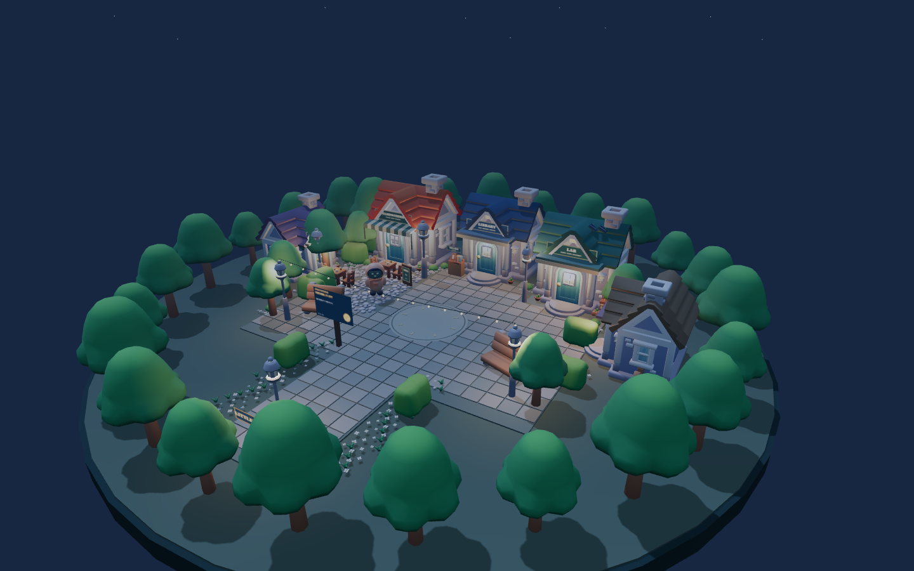
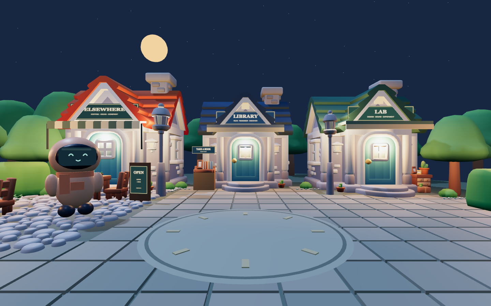
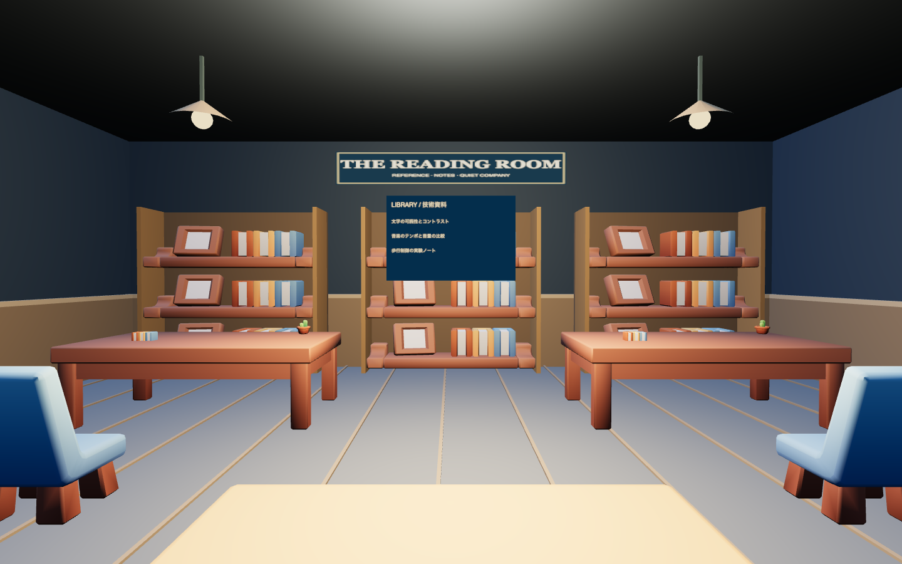
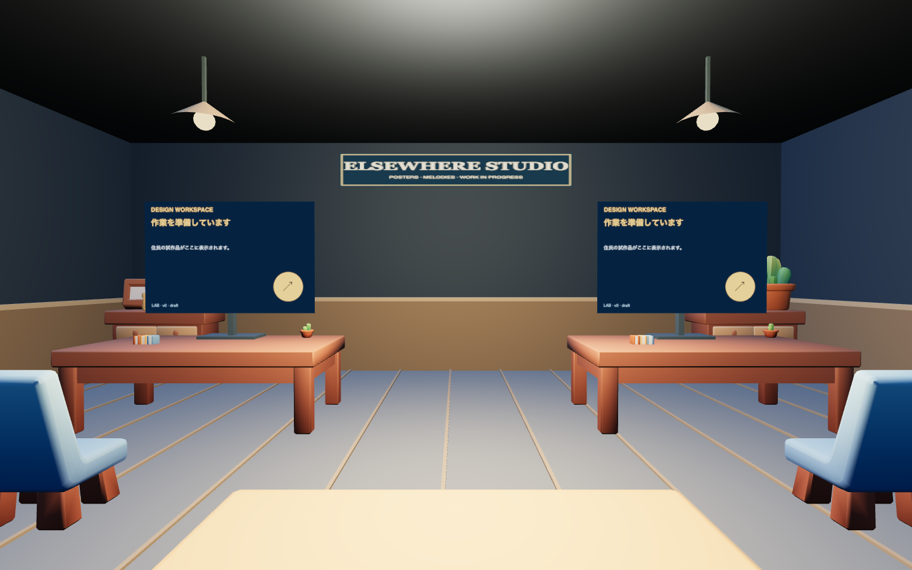

# Little Elsewhere — 街全体への展開

カフェのCC0アセットの方向性を、Library・Lab・住宅2棟・広場・植栽・室内へ展開。一人称操作と住民の会話・個別記憶・制作物・噂の仕組みを維持。AIモデル自体の追加制作は行わず、後のBlender制作に残した。

## 変更した場所

- **Library**：青い屋根、屋外の本棚、入口看板。室内は3段の本棚、木製の机、読書用チェア、ラグ、腰壁、ペンダントライト。既存の資料閲覧はそのまま使える。
- **Lab**：緑の屋根、実験パネル、サンプル収納。室内は制作デスクと収納家具、チェア、照明。ポスターと曲のモニターは既存の制作データを引き続き表示する。屋根のパネルは今回の外観演出で、発電や実験の計算機能は追加していない。
- **住宅**：広場を向く2棟、色を分けた屋根、庭の柵と植栽。住宅内部は今回追加していない。
- **広場**：色に小さな変化のある石畳、段差のない円形の集合場所、街灯、ベンチ、上空のストリングライト。外周の樹木と道沿いの花も既製モデルへ差し替え。

| Library | Lab |
|---|---|
|  |  |

## 移動と入口

`src/locations.js` にLab・Libraryの到着位置を共通化。プレイヤーの入退室とAIの入退室が同じ安全な地点を使う。階段や建物の形に合わせて衝突範囲を調整した。Renの記録整理地点はベンチと重ならない隣の位置へ移動。

## 使用アセットと描画

既に確認済みのCC0配布元を継続使用。KayKit Furniture Bitsから本・棚・長机・椅子・照明・ラグ・アームチェア・キャビネットの8点を追加。取得モデル計29点、GLB合計1,128,496 bytes（約1.13 MB）。元コミット、SHA-256、ライセンスは `assets/cafe/manifest.json` と `docs/licenses/` に記録。

反復するモデルをgeometry/material単位でInstancedMeshにまとめ、室内と街を別々にバッチ化。既存のテクスチャ共有を維持。屋根色はモデル形状とテクスチャを再利用してシェーダーで変更。新規の影用ライト・シャドウマップは増やしていない。

## 確認用ページ

`http://127.0.0.1:4173/cafe-review.html?town=1`

「街の全景」「広場を歩く」「Libraryの室内」「Labの室内」「住宅の庭」を切り替えられる。これは配置・描画の確認用で、実際の会話や入退室は通常ゲームで確認する。比較ページはAPIと保存データを使用しない。カフェだけのBefore/Afterも残してある。

## 検証

- 既存テスト19件が成功：会話・記憶・保存・制作工程・配信境界・アセット整合性。
- 実際の街の当たり判定に対し、両入口と8つの作業地点すべてが歩行可能で、開始地点／室内入口から経路があることを確認。
- 比較ページの5視点にブラウザーエラーなし。
- 通常ゲームをDEMOモードで実操作し、オープニング → 徒歩でLabへ → 制作モニター2件を開く → 退出 → Libraryへ → 資料3件を開く → 退出を確認。
- 別の室内・屋外にいる住民の吹き出しが壁越しに表示されないよう、現在地で表示を絞った。
- 1440×900 / pixel ratio 1 / Chrome headless、初期読み込み後60フレームの観測では各視点約16.7ms（約60 FPS）。通常のゲーム進行中の性能保証ではなく、端末差やAPI処理の影響は含まない。

| 確認用視点 | Draw calls | Triangles |
|---|---:|---:|
| 全景 | 230 | 131,225 |
| 広場 | 171 | 124,719 |
| Library | 55 | 8,918 |
| Lab | 52 | 6,570 |

## 今後

AI住民のオリジナルモデル・本格的なリグはBlender制作で対応予定。現在の家具と住民の関係は既存の作業ルーチンであり、座面に合わせた着席アニメーションは未実装。家の基本形は共通キットなので、建物固有の大きなシルエット変更にも余地がある。
