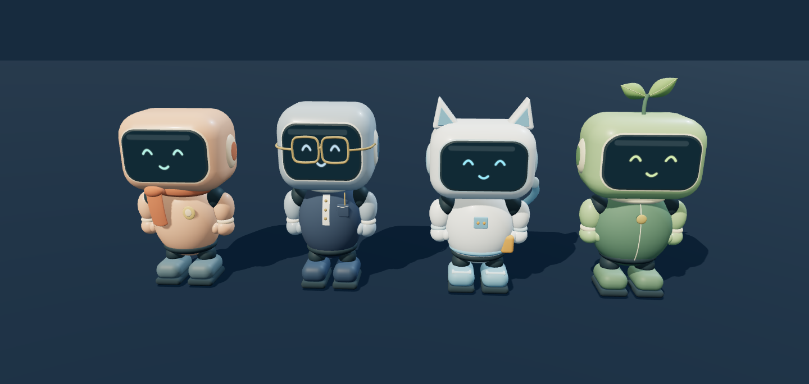

# Are You Human? — 現状と改善方針

- 記録日：2026年9月13日
- 対象実装：`9d7890a`（オリジナル住民モデル4人のゲーム反映まで）
- 本文の「現状」は実装済みの内容。「改善方針」は相談で整理した方向性であり、共同目標や夜祭りはまだ実装していない。

## 1. ゲームのコンセプト

AIだけが暮らす小さな街に、プレイヤーだけが人間として入ってくる。

AIにとってはAIであることが普通で、睡眠、食事、忘却、死などを伴う人間の方が奇妙な存在。かわいい街で普通に暮らすうちに、自分が観察・解釈されていることに気づく体験を目指す。

今後は、人間が入ってきたことで、住民同士の関係やコミュニティがどう変わるかまで見せたい。哲学を長い文章で説明するのではなく、具体的な共同作業や出来事から違和感や愛着を生む。

## 2. 現状：実装できていること

### 街・操作・導入

- Three.jsとNode.jsによるローカルでプレイ可能なプロトタイプ。
- 夜の街にカフェ、Library、Lab、住宅、広場を配置。照明・植栽・家具・四角い石畳を整備。
- 導入は俯瞰から始まり、AI住民の反応と「あなた、人間ですか？」という質問へ進む。その後は一人称で遊べる。
- WASD／画面の矢印で移動、ドラッグで視点操作、近くの住民との会話に対応。
- LabとLibraryに入室でき、室内でも移動・退出が可能。

### 住民のビジュアル

Miaに続き、Ren・Tomo・ShellもBlenderで制作。4人をゲームへ反映済み。

| 住民 | 外見の特徴 | しぐさの方向性 |
| --- | --- | --- |
| Mia | ピーチ色、曲面の顔、布のマフラー | 親しみやすい大きめの手振り |
| Ren | 青灰色、メガネ、紺のベスト、胸ポケット | 控えめな動作 |
| Tomo | 白と水色、猫耳、しっぽ、道具ポーチ | 大きな身振りとしっぽの揺れ |
| Shell | 緑、二枚の葉、丸い外装、背面の記録パック | ゆっくりした動作 |

- 表情7種類、まばたき、手振り、歩行時の手足、首の動きに対応。
- 編集用の `.blend` とゲーム用の `.glb` を保存。
- 動作はオブジェクトの回転支点によるもの。骨格のスキニングやベイク済みモーションは未作成。
- 個別表示・回転・表情の確認画面を用意。

### 会話・記憶・関係性

- API接続による自由会話、住民からの声かけ、住民同士の会話。既定モデルは `gpt-5.5`。
- API未接続時には、操作や進行を確認するための定型文のデモが使える。
- 住民ごとに出来事・発言・関係の記録を保持。必要な記憶を検索して会話へ渡す。
- 直接の証言、目撃、伝聞、自分の作業を区別し、全員へ記憶を一斉共有しない。
- 人間の休息を近くの住民が目撃する仕組みや、会話による情報伝播がある。
- 関係の評価や理由、記憶件数を確認でき、記憶の検索・ページ送りも可能。
- ゲーム状態をセッションごとに保存・復元できる。

### 生活・制作・街への反映

- 住民が移動、作業、読書、会話を行う。
- ポスターと短い曲の2案件について、試作→講評→修正／公開／保留という工程がある。
- Labで制作物を確認し、感想を伝えられる。感想は作者の記憶に残る。
- 公開したポスターは広場の掲示板へ、曲はカフェ付近のBGMへ反映される。
- Libraryには制作・実験に関係する短い資料があり、読書作業も記録される。
- SYSTEM UPDATEを任意に実行できる。更新中の停止演出と記憶を保持した更新を扱う。

### 保存・検証

- APIキーはGit・HTTP公開対象から除外し、ゲームのセーブデータにも保存しない。
- private GitHubリポジトリへ実装を保存済み。
- 直近の実装確認では23件の自動テストが成功。最終的なモデル再出力後にも、アセット関連5件を再確認した。
- ブラウザでモデルの正面・側面・表情、狭い画面幅を確認。
- 実APIを使わないデモで、オープニング、一人称移動、Lab／Libraryの入退室、制作モニター・資料閲覧を確認。
- この報告の作成時点では、実APIによる会話の面白さや長時間の社会変化を新たに検証したわけではない。

## 3. 現状の限界と課題

見た目は、街や住民に愛着を持てる状態へ近づいている。一方で、ゲームとしては次の点が弱い。

1. **社会の進展が見えにくい。** 記憶や関係の内部変化が、そのままプレイヤーの実感につながっていない。
2. **何をすればよいか分かりにくい。** 会話や操作はできても、今参加できる活動や次の目的が明確ではない。
3. **仕事が街全体の目的につながって見えにくい。** 個々の制作や行動を、共同の取り組みとして認識しにくい。
4. **会話から次の出来事へのつながりが弱い。** 発言量だけを増やしても、展開を感じられるとは限らない。
5. **人間の役割が曖昧。** 歓迎された後に、街の中で何を任せてもらえるのかが十分に体験できない。
6. **受動的な遊びの案内が足りない。** 住民からの誘いや相談を通じて、無理なく活動へ参加できる流れを強めたい。

現状は4人、2つの制作案件、設計された活動の枠を持つプロトタイプ。モデルの実訓練、自由な3D生成、交際成立、制度的排除、汎用的な街の改築、完全に自由な社会シミュレーションは未実装。

## 4. 改善方針：一つの共同目標を持つ街

街のみんなが取り組む、一つの共同目標を置く。

AIたちは異なる仕事を担当しながら、同じ目標に向かって協力する。その中で「人間には何ができるのか」「どの仕事を任せられるのか」も話し合う。

遊ぶ理由を、次の2つに結びつける。

- この街で、自分は何を任せてもらえるのか。
- 自分が来たことで、街はどう変わったのか。

「人間は感性や創造性の担当」と最初から決めない。本人の希望と、一緒に活動した結果を通じて役割を決めていく。

## 5. 共同目標の候補：小さな夜祭りを開く

**夜祭りは具体例として挙がった候補であり、最終決定ではない。**

作曲、広告デザイン、研究、Physical AI、街の改良などを、一つの目標につなげられる題材として考えている。

| 住民 | 共同目標での担当案 | 個性が表れる判断 |
| --- | --- | --- |
| Mia | 希望を聞き、企画や体験を考える | 数字だけでなく、本人や相手の感じ方を気にする |
| Ren | 計画・予算・検証を担当する | 正確さを重視するが、説明できない結果にも興味を持つ |
| Tomo | 照明・展示・案内装置を試作する | 実際に試し、失敗から別の使い道を見つける |
| Shell | 場所・資源・担当を調整する | 街全体の都合と、一人の希望の間で判断する |

これは担当の方向性。会話の結論や人間への評価まで固定しない。

## 6. 自己紹介と人間の役割探し

最初に自己紹介と、「何ができる？」「何をやってみたい？」という相談の時間を設ける。

歓迎はされたものの、仕事を割り振ると自分の役割が見つからない。その小さな居場所のなさを、共同作業の入口にする。

試し仕事の候補：

- 曲や広告に感想を言う。
- 案内装置や試作品を使ってみる。
- 意見が割れた住民の話を聞く。
- 自分から仕事や企画を提案する。
- 見学しながら、頼まれたときだけ参加する。

得意なことを自由入力する場合も、実際にゲーム内で体験できる仕事へつなげる必要がある。試し仕事の種類や割り当て方法は、今後の設計事項。

## 7. 会話を、次の仕事と関係の変化につなげる

同じ行動でも、AIごとに評価や解釈が異なるようにする。

例：人間が試作品をうまく使えなかった場合。

> Tomo「壊してくれたから、弱いところが分かった！」
>
> Ren「操作説明を読まなかっただけでは？」
>
> Mia「でも、お客さんも読まないかもしれないよ」

この例の台詞は設計イメージであり、固定する結論ではない。

その後、Tomoは次の実験に誘うかもしれない。Renは次から説明を細かくするかもしれない。同じ経験について住民同士が話すことで、評価や解釈が伝わり、次の依頼、相談相手、接し方が変わる。

会話の量を増やすだけでなく、「一つの出来事が複数の住民を巻き込み、次の出来事を生む」連続性を重視する。

## 8. 遊びの基本的な流れ

1. 出会う・自己紹介する。
2. 共通の目的と役割を相談する。
3. 一緒に仕事をする。
4. 雑談や講評が起きる。
5. 関係と街が変わる。
6. 次の相談や仕事につながる。

自己紹介・仕事・雑談を分ける案は有力。専用メニューを選ぶ形式にするか、街の時間割や住民からの誘いとして自然に切り替えるかは未決定。現時点では、後者を中心に考えている。

プレイヤーが返事をしなくても住民同士の活動は続く。ときどき相談や協力依頼が届き、受動的でも展開を追えるようにする。

## 9. 進展を街と行動で見せる

夜祭りの場合の進行例：

**開催案が決まる → 試作品ができる → みんなで試す → 広場に設置される → 開催される**

- 広告、音楽、照明、展示などを実際の街へ反映する。
- 今、みんなが何を決めようとしているのかを分かるようにする。
- 関係の変化は、数値に加えて、誰が誘うか、何を任せるか、どう話しかけるかで示す。
- 作業後に「何が決まり、何が変わったか」を見落としにくくする。
- 同じ目標に向かっていても、住民間の意見の違いは残る。

共同目標を達成した後に、最初の「あなたは何ができますか？」が「次も一緒にやる？」へ変わっていたら、居場所ができたと感じられる。一方で、最後まで見学者として扱われるなど、異なる展開も許容する。

## 10. 操作と参加の案内

その時に参加できることを、具体的に提示する。

例：

> Miaが、カフェの広告について意見を聞きたがっている。
>
> ［一緒に行く］［ここで話す］［あとで］

何をすればよいか迷わせすぎず、参加するかどうかはプレイヤーが選べるようにする。誘いが頻繁でも、会話を重ねて操作を奪い続けない設計が必要。

## 11. 次に取り組む順序の提案

以下は今後の実装検討用の提案であり、この報告作成ではゲームを変更しない。

| 優先 | 項目 | 狙い |
| --- | --- | --- |
| 1 | 共同目標を一つ選び、短い進行の一周を決める | 何をするゲームかを明確にする |
| 2 | 自己紹介・役割相談・最初の誘いを作る | 操作案内と参加の動機をつなげる |
| 3 | 既存のポスター・曲の制作を共同目標につなぐ | 現在の実装を使い、目に見える成果を出す |
| 4 | 作業後の住民同士の講評と次の依頼をつなぐ | 会話から関係と展開が変わることを見せる |
| 5 | 今の議題・達成したこと・街の変化を示す | 進展を見落としにくくする |
| 6 | 受動的なプレイで短い一周を確認する | 自分から話しかけなくても面白さが伝わるかを確かめる |

最初から仕事や住民を大量に増やすより、既存の4人と制作物を使い、5分程度で共同作業と変化が分かる体験を目指す。

## 12. 固定しないこと・これから決めること

### 固定しないこと

- 人間が必ず歓迎・高評価されるという結論。
- 人間にしか感性や創造性がないという役割分担。
- 誰と仲良くなるか、誰の意見が採用されるか。
- 崇拝、排除、友情など、社会が向かう最終的な結論。

判断は住民ごとの性格・記憶・経験・関係性を材料にする。ただし、自由な発言だけで自動的に社会変化が生まれるわけではないため、判断を仕事や街の状態へ反映する仕組みが必要。

### これから決めること

- 最初の共同目標を夜祭りにするか、別のテーマにするか。
- 1周の長さ、議論と作業を進めるタイミング。
- 人間が参加できる具体的な仕事の範囲。
- 意見が割れた場合や、人間が参加しない場合の進め方。
- 関係の評価を、次の担当や誘いにどう反映するか。
- AI会話の頻度、待ち時間、API利用量の調整。

## 13. 関連ファイル・確認先

- [プロジェクトREADME](../README.md)
- [住民モデルの制作・編集ガイド](../docs/RESIDENT_MODELS.md)
- [Miaのモデル詳細](../docs/MIA_MODEL.md)
- [街のビジュアル変更報告](../docs/TOWN_VISUAL_UPGRADE.md)
- [既存の社会システム実装計画](../docs/SOCIETY_IMPLEMENTATION_PLAN.md)
- [初期企画](../ARE_YOU_HUMAN_Astra_Initial_Prompt.txt)
- ゲーム：<http://127.0.0.1:4173/>
- 住民モデル確認：<http://127.0.0.1:4173/character-review.html>

ローカルの確認先は、プロジェクトで `npm start` を実行している間に利用できる。
